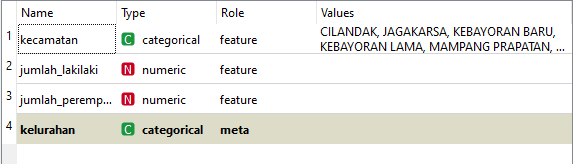
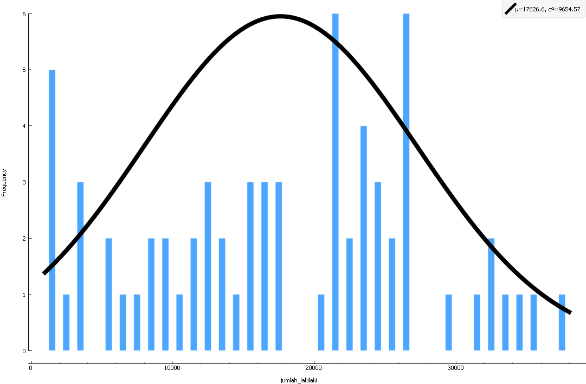
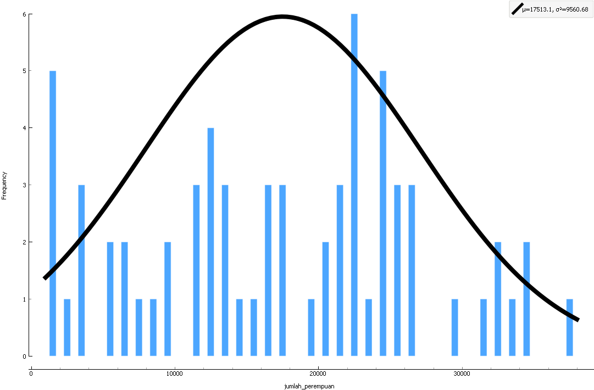

**Tugas Data Mining**

Nama : Anisatul Ma'tsaroh

Nim	: 180441100006

**Data Kependudukan Tahun 2019 Kota Jakarta**

Sumber : http://data.jakarta.go.id/dataset/data-kependudukan-wilayah-kota-adm-jakarta-selatan-tahun-2018/resource/8881a3b1-507b-404b-8f6c-8b07f3243da4

Tipe Data

Distribusi Data

- Laki-laki

- Perempuan

Rata-rata Jumlah Penduduk Laki-laki Tahun 2019 : 17744.70769

Rata-rata Jumlah Penduduk Perempuan Tahun 2019 : 17631.01538

Standar Deviasi Jumlah Penduduk Laki-laki Tahun 2019 : 9829.324922

Standar Deviasi Jumlah Penduduk Perempuan Tahun 2019 : 9732.989641

